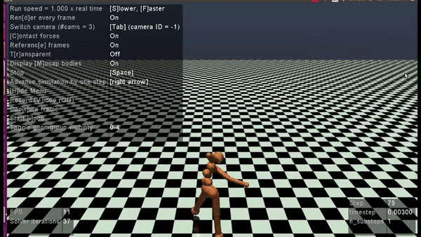

# DDPG Humanoid
We conducted experiments of the performance of DDPG algorithm on the OpenAI Humanoidv2 environment based on what we learned from Lillicrap et al. (2016) and Plappert et al. (2018).  Lillicrap et al. (2016) is about the DDPG algorithm, with noise, sampled with the OrnsteinUhlenbeck process, in the action space for exploration, while Plappert et al. (2018) is about possible improvements with noise in the parameter space.

With the experiments we conducted, we saw that the DDPG algorithm without noise is by far the best performer in learning policies for the OpenAI gym Humanoid-v2 environment. 

## Demo

## Experiment Report
https://github.com/mokeam/DDPG-Humanoid/garba_makinwa_ddpg_humanoid_report.pdf
